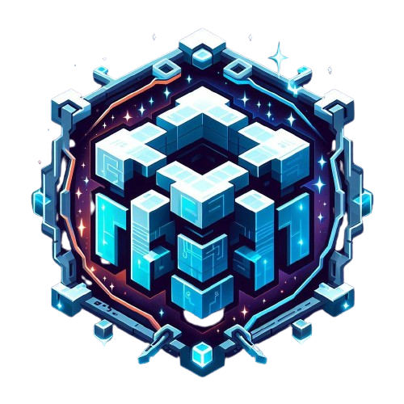

# Bienvenue dans l'Organisation Quantium

Bienvenue dans l'organisation GitHub de Quantium, un serveur Minecraft RolePlay Moddé avec un système de chapitre pour chaque version. Quantium propose un tout nouveau système de roleplay qui reprend les bases du RP pour plaire à tout le monde.

## À Propos de Quantium

Quantium est bien plus qu'un simple serveur Minecraft. C'est une communauté passionnée de RolePlay et de création, où chaque joueur a la possibilité de s'immerger dans un monde riche en histoire, en quêtes et en interactions. Notre serveur se distingue par :

- **Système de Chapitre** : Chaque version de Quantium est un nouveau chapitre dans l'histoire, avec son propre ensemble de quêtes, de personnages et de défis.
  
- **Modifications Personnalisées** : Notre équipe de développement crée des mods exclusifs pour enrichir l'expérience de jeu et offrir des fonctionnalités uniques.

## Ressources Utiles

- [Site Web de Quantium](https://quantium.legoshii.com) : Visitez notre site web pour en savoir plus sur Quantium, rejoindre la communauté et accéder aux dernières informations.

- [Nous rejoindre](https://quantium.legoshii.com/play) : Rejoignez nous !

- [Discord](https://quantium.legoshii.com/discord) : Rejoignez notre serveur Discord pour discuter en direct avec d'autres joueurs, poser des questions et rester informé des dernières nouvelles.

## Contact

Si vous avez des questions, des suggestions ou si vous souhaitez simplement en savoir plus sur Quantium, n'hésitez pas à nous contacter :

- **Email** : contact@legoshii.com

Nous sommes impatients de vous accueillir dans notre communauté et de partager des aventures incroyables ensemble !

